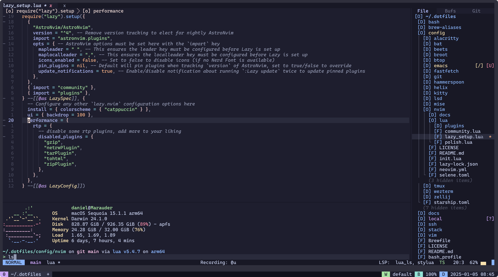

# Neovim Config

My [Neovim](https://neovim.io) / [AstroNvim](https://github.com/AstroNvim/AstroNvim) config.



## Installation

Clone this repo into `~/.config/nvim`:

```
git clone https://github.com/unindented/neovim-config.git ~/.config/nvim
```

Then start Neovim:

```
nvim
```

> [!NOTE]
>
> Run `:checkhealth` to identify and resolve any issues.

### Node

Install the `neovim` package:

```
npm i -g neovim
```

### Perl

Install `cpanm` to make installing other modules easier:

```
cpan App::cpanminus
```

Then install the `Neovim` module:

```
cpanm -n Neovim::Ext
```

> [!NOTE]
>
> You may need to symlink `cpanm` yourself:
>
> ```
> cd "$(brew --prefix)/bin"
> ln -s ../Cellar/perl/5.38.2_1/bin/cpanm cpanm
> ```

### Python

Install the `pynvim` package:

```
python3 -m pip install --user --upgrade pynvim
```

### Ruby

Install the `neovim` gem:

```
gem install neovim
```

## Meta

- Code: `git clone https://github.com/unindented/neovim-config.git`
- Home: <https://github.com/unindented/neovim-config>

## Contributors

Daniel Perez Alvarez ([daniel@unindented.org](mailto:daniel@unindented.org))

## License

Copyright (c) 2024 Daniel Perez Alvarez ([unindented.org](https://www.unindented.org/)). This is free software, and may be redistributed under the terms specified in the LICENSE file.
